# UML Class Diagrams

This document contains class diagrams for both the current monolithic architecture and the planned future refactored architecture.

---

## Current Architecture - Monolithic Design

### Class Diagram

### Current Class Details

**ExpenseTrackerApp** - Single class handling all functionality

**Responsibilities:**
- Database connection management
- Table creation and initialization
- User interface (console menu)
- Transaction CRUD operations
- Category management
- Report generation
- CSV export
- Input validation

**Dependencies:**
- `java.sql.Connection` - Database connectivity
- `java.util.Scanner` - User input
- `java.sql.PreparedStatement` - SQL execution
- `java.sql.ResultSet` - Query results
- `java.time.LocalDate` - Date handling
- `java.io.PrintWriter` - File output

**Design Pattern:** None (monolithic)

**Pros:**
- Simple to understand
- Easy to debug
- Single file deployment
- Good for learning JDBC

**Cons:**
- Poor separation of concerns
- Hard to test
- Difficult to maintain as it grows
- Code duplication
- Tight coupling

---

## Future Architecture - Layered MVC Design

### Complete Class Diagram

```mermaid
classDiagram
    %% ============================================
    %% ENTITY LAYER (Model)
    %% ============================================
    class Transaction {
        -int id
        -double amount
        -String description
        -LocalDate transactionDate
        -Category category
        -LocalDateTime createdAt
        -LocalDateTime updatedAt
        
        +Transaction()
        +Transaction(double, String, LocalDate, Category)
        +getId() int
        +setId(int) void
        +getAmount() double
        +setAmount(double) void
        +getDescription() String
        +setDescription(String) void
        +getTransactionDate() LocalDate
        +setTransactionDate(LocalDate) void
        +getCategory() Category
        +setCategory(Category) void
        +getCreatedAt() LocalDateTime
        +getUpdatedAt() LocalDateTime
        +toString() String
        +equals(Object) boolean
        +hashCode() int
    }
    
    class Category {
        -int id
        -String name
        -String description
        -LocalDateTime createdAt
        -List~Transaction~ transactions
        
        +Category()
        +Category(String)
        +getId() int
        +setId(int) void
        +getName() String
        +setName(String) void
        +getDescription() String
        +setDescription(String) void
        +getCreatedAt() LocalDateTime
        +getTransactions() List~Transaction~
        +addTransaction(Transaction) void
        +removeTransaction(Transaction) void
        +toString() String
        +equals(Object) boolean
        +hashCode() int
    }
    
    %% ============================================
    %% DATA ACCESS LAYER (DAO)
    %% ============================================
    class TransactionDAO {
        -Connection connection
        
        +TransactionDAO(Connection)
        +create(Transaction) int
        +findById(int) Transaction
        +findAll() List~Transaction~
        +findByDateRange(LocalDate, LocalDate) List~Transaction~
        +findByCategory(int) List~Transaction~
        +findByMonth(YearMonth) List~Transaction~
        +update(Transaction) boolean
        +delete(int) boolean
        +count() int
        -mapResultSetToTransaction(ResultSet) Transaction
    }
    
    class CategoryDAO {
        -Connection connection
        
        +CategoryDAO(Connection)
        +create(Category) int
        +findById(int) Category
        +findAll() List~Category~
        +findByName(String) Category
        +update(Category) boolean
        +delete(int) boolean
        +exists(int) boolean
        -mapResultSetToCategory(ResultSet) Category
    }
    
    class BaseDAO {
        <<abstract>>
        #Connection connection
        
        +BaseDAO(Connection)
        #getConnection() Connection
        #closeResources(AutoCloseable...) void
    }
    
    %% ============================================
    %% SERVICE LAYER (Business Logic)
    %% ============================================
    class TransactionService {
        -TransactionDAO transactionDAO
        -CategoryDAO categoryDAO
        
        +TransactionService(TransactionDAO, CategoryDAO)
        +addTransaction(double, String, LocalDate, int) Transaction
        +editTransaction(int, Double, String, LocalDate, Integer) Transaction
        +deleteTransaction(int) boolean
        +getTransaction(int) Transaction
        +getAllTransactions() List~Transaction~
        +getRecentTransactions(int) List~Transaction~
        +getTransactionsByMonth(YearMonth) List~Transaction~
        +getTransactionsByDateRange(LocalDate, LocalDate) List~Transaction~
        +validateTransaction(Transaction) void
        +getTotalSpending() double
        +getTotalSpendingByMonth(YearMonth) double
    }
    
    class CategoryService {
        -CategoryDAO categoryDAO
        -TransactionDAO transactionDAO
        
        +CategoryService(CategoryDAO, TransactionDAO)
        +addCategory(String, String) Category
        +editCategory(int, String, String) Category
        +deleteCategory(int) boolean
        +getCategory(int) Category
        +getAllCategories() List~Category~
        +getCategoryByName(String) Category
        +isCategoryUsed(int) boolean
        +validateCategory(Category) void
    }
    
    class ReportService {
        -TransactionDAO transactionDAO
        
        +ReportService(TransactionDAO)
        +getMonthlySummary(YearMonth) MonthlySummary
        +getYearlySummary(int) YearlySummary
        +getCategoryBreakdown(YearMonth) Map~String, Double~
        +getSpendingTrend(int) List~MonthlyTotal~
        +generateReport(ReportType, LocalDate, LocalDate) Report
    }
    
    class ExportService {
        -TransactionDAO transactionDAO
        
        +ExportService(TransactionDAO)
        +exportToCSV(String, List~Transaction~) void
        +exportToPDF(String, List~Transaction~) void
        +exportToExcel(String, List~Transaction~) void
        +importFromCSV(String) List~Transaction~
    }
    
    class BudgetService {
        -BudgetDAO budgetDAO
        -TransactionDAO transactionDAO
        
        +BudgetService(BudgetDAO, TransactionDAO)
        +setBudget(int, double, YearMonth) Budget
        +getBudget(int, YearMonth) Budget
        +checkBudgetStatus(int, YearMonth) BudgetStatus
        +getBudgetAlerts() List~BudgetAlert~
        +calculateRemainingBudget(int, YearMonth) double
    }
    
    %% ============================================
    %% CONTROLLER LAYER
    %% ============================================
    class TransactionController {
        -TransactionService transactionService
        -UserInterface ui
        
        +TransactionController(TransactionService, UserInterface)
        +handleAddTransaction() void
        +handleEditTransaction() void
        +handleDeleteTransaction() void
        +handleViewTransactions() void
        +handleViewTransaction(int) void
    }
    
    class CategoryController {
        -CategoryService categoryService
        -UserInterface ui
        
        +CategoryController(CategoryService, UserInterface)
        +handleAddCategory() void
        +handleEditCategory() void
        +handleDeleteCategory() void
        +handleViewCategories() void
    }
    
    class ReportController {
        -ReportService reportService
        -UserInterface ui
        
        +ReportController(ReportService, UserInterface)
        +handleMonthlySummary() void
        +handleYearlySummary() void
        +handleCategoryReport() void
        +handleSpendingTrend() void
    }
    
    class ExportController {
        -ExportService exportService
        -UserInterface ui
        
        +ExportController(ExportService, UserInterface)
        +handleExportCSV() void
        +handleExportPDF() void
        +handleImportCSV() void
    }
    
    %% ============================================
    %% UI LAYER
    %% ============================================
    class UserInterface {
        <<interface>>
        +displayMenu() void
        +getInput(String) String
        +getIntInput(String) int
        +getDoubleInput(String) double
        +getDateInput(String) LocalDate
        +displayMessage(String) void
        +displayError(String) void
        +displaySuccess(String) void
        +displayTransactions(List~Transaction~) void
        +displayCategories(List~Category~) void
        +displaySummary(MonthlySummary) void
        +confirm(String) boolean
    }
    
    class ConsoleUI {
        -Scanner inputReader
        
        +ConsoleUI()
        +displayMenu() void
        +getInput(String) String
        +getIntInput(String) int
        +getDoubleInput(String) double
        +getDateInput(String) LocalDate
        +displayMessage(String) void
        +displayError(String) void
        +displaySuccess(String) void
        +displayTransactions(List~Transaction~) void
        +displayCategories(List~Category~) void
        +displaySummary(MonthlySummary) void
        +confirm(String) boolean
        -formatCurrency(double) String
        -formatDate(LocalDate) String
    }
    
    class JavaFXUI {
        -Stage primaryStage
        -Scene currentScene
        
        +JavaFXUI(Stage)
        +displayMenu() void
        +getInput(String) String
        +getIntInput(String) int
        +getDoubleInput(String) double
        +getDateInput(String) LocalDate
        +displayMessage(String) void
        +displayError(String) void
        +displaySuccess(String) void
        +displayTransactions(List~Transaction~) void
        +displayCategories(List~Category~) void
        +displaySummary(MonthlySummary) void
        +confirm(String) boolean
        -createMenuScene() Scene
        -createTransactionScene() Scene
        -showAlert(String, AlertType) void
    }
    
    %% ============================================
    %% UTILITY CLASSES
    %% ============================================
    class DatabaseConnection {
        -String url$
        -String username$
        -String password$
        -Connection connection$
        
        -DatabaseConnection()
        +getInstance()$ Connection
        +closeConnection()$ void
        +testConnection()$ boolean
    }
    
    class ValidationUtil {
        +isValidAmount(double)$ boolean
        +isValidDate(String)$ boolean
        +isValidDateRange(LocalDate, LocalDate)$ boolean
        +isValidCategory(int)$ boolean
        +isValidDescription(String)$ boolean
        +validateRequired(String, String)$ void
    }
    
    class DateUtil {
        +parseDate(String)$ LocalDate
        +formatDate(LocalDate)$ String
        +getCurrentMonth()$ YearMonth
        +getMonthStart(YearMonth)$ LocalDate
        +getMonthEnd(YearMonth)$ LocalDate
        +isValidDateFormat(String)$ boolean
    }
    
    class CurrencyUtil {
        +formatCurrency(double)$ String
        +parseCurrency(String)$ double
        +roundToTwoDecimals(double)$ double
    }
    
    %% ============================================
    %% VALUE OBJECTS
    %% ============================================
    class MonthlySummary {
        -YearMonth month
        -Map~String, Double~ categoryTotals
        -double grandTotal
        -int transactionCount
        
        +MonthlySummary(YearMonth)
        +getMonth() YearMonth
        +getCategoryTotals() Map~String, Double~
        +getGrandTotal() double
        +getTransactionCount() int
        +addCategoryTotal(String, double) void
    }
    
    class BudgetStatus {
        -Budget budget
        -double spent
        -double remaining
        -double percentageUsed
        
        +BudgetStatus(Budget, double)
        +getBudget() Budget
        +getSpent() double
        +getRemaining() double
        +getPercentageUsed() double
        +isOverBudget() boolean
        +isNearLimit() boolean
    }
    
    %% ============================================
    %% RELATIONSHIPS
    %% ============================================
    Transaction "1" --> "1" Category : belongs to
    Category "1" --> "*" Transaction : has many
    
    TransactionDAO --|> BaseDAO : extends
    CategoryDAO --|> BaseDAO : extends
    
    TransactionDAO --> Transaction : manages
    CategoryDAO --> Category : manages
    
    TransactionService --> TransactionDAO : uses
    TransactionService --> CategoryDAO : uses
    CategoryService --> CategoryDAO : uses
    CategoryService --> TransactionDAO : uses
    ReportService --> TransactionDAO : uses
    ExportService --> TransactionDAO : uses
    
    TransactionController --> TransactionService : uses
    TransactionController --> UserInterface : uses
    CategoryController --> CategoryService : uses
    CategoryController --> UserInterface : uses
    ReportController --> ReportService : uses
    ReportController --> UserInterface : uses
    ExportController --> ExportService : uses
    ExportController --> UserInterface : uses
    
    ConsoleUI ..|> UserInterface : implements
    JavaFXUI ..|> UserInterface : implements
    
    TransactionService ..> ValidationUtil : uses
    CategoryService ..> ValidationUtil : uses
    ConsoleUI ..> DateUtil : uses
    ConsoleUI ..> CurrencyUtil : uses
    
    ReportService ..> MonthlySummary : creates
    BudgetService ..> BudgetStatus : creates
```

---

## Layer Descriptions

### **1. Entity Layer (Model)**

**Purpose:** Represent domain objects as Java classes

**Classes:**
- `Transaction` - Represents a single expense transaction
- `Category` - Represents an expense category

**Responsibilities:**
- Encapsulate business data
- Provide getters/setters
- Implement equals(), hashCode(), toString()
- No business logic or database access

**Design Pattern:** Plain Old Java Objects (POJOs)

---

### **2. Data Access Layer (DAO)**

**Purpose:** Abstract database operations from business logic

**Classes:**
- `BaseDAO` - Common database operations
- `TransactionDAO` - Transaction CRUD operations
- `CategoryDAO` - Category CRUD operations

**Responsibilities:**
- Execute SQL queries
- Map ResultSets to entities
- Handle database exceptions
- Manage database connections

**Design Pattern:** Data Access Object (DAO)

**Benefits:**
- Separates data access from business logic
- Easy to switch databases
- Centralized SQL queries
- Reusable code

---

### **3. Service Layer (Business Logic)**

**Purpose:** Implement business rules and orchestrate operations

**Classes:**
- `TransactionService` - Transaction business logic
- `CategoryService` - Category business logic
- `ReportService` - Report generation
- `ExportService` - Data export/import
- `BudgetService` - Budget management

**Responsibilities:**
- Validate business rules
- Coordinate multiple DAOs
- Implement complex operations
- Handle transactions (if needed)

**Design Pattern:** Service Layer, Facade

**Benefits:**
- Centralized business logic
- Reusable across different UIs
- Testable without database
- Clear separation of concerns

---

### **4. Controller Layer**

**Purpose:** Handle user interactions and coordinate between UI and services

**Classes:**
- `TransactionController` - Transaction operations
- `CategoryController` - Category operations
- `ReportController` - Report generation
- `ExportController` - Export/import operations

**Responsibilities:**
- Receive user input from UI
- Call appropriate service methods
- Handle exceptions
- Return results to UI

**Design Pattern:** Model-View-Controller (MVC)

---

### **5. User Interface Layer**

**Purpose:** Present data to users and collect input

**Classes:**
- `UserInterface` - Interface defining UI contract
- `ConsoleUI` - Console-based implementation
- `JavaFXUI` - GUI implementation (future)

**Responsibilities:**
- Display menus and data
- Collect user input
- Format output
- Show error messages

**Design Pattern:** Strategy, Interface Segregation

**Benefits:**
- Multiple UI implementations
- UI changes don't affect business logic
- Easy to add web/mobile interfaces

---

### **6. Utility Classes**

**Purpose:** Provide reusable helper functions

**Classes:**
- `DatabaseConnection` - Singleton connection manager
- `ValidationUtil` - Input validation
- `DateUtil` - Date formatting/parsing
- `CurrencyUtil` - Currency formatting

**Responsibilities:**
- Common utility functions
- Cross-cutting concerns
- Format conversions

**Design Pattern:** Singleton (DatabaseConnection), Static utility methods

---

## Design Patterns Used

### **1. Data Access Object (DAO)**
- **Location:** DAO Layer
- **Purpose:** Separate persistence logic from business logic
- **Example:** TransactionDAO, CategoryDAO

### **2. Service Layer**
- **Location:** Service Layer
- **Purpose:** Encapsulate business logic
- **Example:** TransactionService, CategoryService

### **3. Model-View-Controller (MVC)**
- **Location:** Entire architecture
- **Purpose:** Separate concerns into three layers
- **Model:** Entity classes
- **View:** UI classes
- **Controller:** Controller classes

### **4. Singleton**
- **Location:** DatabaseConnection
- **Purpose:** Ensure single database connection
- **Implementation:** Private constructor, static getInstance()

### **5. Strategy**
- **Location:** UserInterface implementations
- **Purpose:** Different UI strategies (Console, GUI)
- **Implementation:** Interface with multiple implementations

### **6. Factory (Future)**
- **Location:** Object creation
- **Purpose:** Create objects without specifying exact class
- **Example:** TransactionFactory, UIFactory

---

## Class Interaction Example: Add Transaction

---

## Migration Path from Current to Future

### **Phase 1: Extract Entities**
1. Create `Transaction` class
2. Create `Category` class
3. Update existing code to use entities

### **Phase 2: Extract DAO Layer**
1. Create `BaseDAO` abstract class
2. Create `TransactionDAO`
3. Create `CategoryDAO`
4. Move all SQL to DAOs

### **Phase 3: Extract Service Layer**
1. Create `TransactionService`
2. Create `CategoryService`
3. Move business logic from main class

### **Phase 4: Extract Controllers**
1. Create controller classes
2. Move UI interaction logic

### **Phase 5: Extract UI Layer**
1. Create `UserInterface` interface
2. Extract `ConsoleUI` implementation
3. Add `JavaFXUI` implementation

---

## Benefits of Refactored Architecture

### **Maintainability:**
- ✅ Changes isolated to specific layers
- ✅ Clear responsibility for each class
- ✅ Easier to understand and modify

### **Testability:**
- ✅ Unit test each layer independently
- ✅ Mock dependencies easily
- ✅ Test business logic without UI/database

### **Scalability:**
- ✅ Add new features without touching existing code
- ✅ Multiple UI implementations
- ✅ Easy to add new report types

### **Flexibility:**
- ✅ Switch databases easily
- ✅ Change UI without affecting business logic
- ✅ Add new integrations

### **Code Reusability:**
- ✅ Services reusable across different UIs
- ✅ DAOs reusable across services
- ✅ Utilities reusable everywhere

---

## Comparison: Current vs Future

| Aspect | Current (Monolithic) | Future (Layered) |
|--------|---------------------|------------------|
| **Classes** | 1 | 20+ |
| **Lines per Class** | 500+ | 100-200 |
| **Testability** | Hard | Easy |
| **Maintainability** | Low | High |
| **Flexibility** | Low | High |
| **Learning Curve** | Low | Medium |
| **Initial Development** | Fast | Slower |
| **Long-term Development** | Slow | Fast |

---

## Tools for Class Diagram Generation

1. **From Code:**
   - IntelliJ IDEA: Diagram → Show Diagram
   - Eclipse: Right-click → Show UML Diagram (with plugin)
   - VS Code: PlantUML extension

2. **Manual Creation:**
   - Mermaid (used here)
   - PlantUML
   - draw.io
   - Lucidchart

3. **Documentation:**
   - JavaDoc with UML diagrams
   - Doxygen with GraphViz

---

## Version History

**Version 1.0 (Current):** Monolithic architecture  
**Version 2.0 (Planned):** Layered MVC architecture  
**Version 3.0 (Future):** Microservices architecture