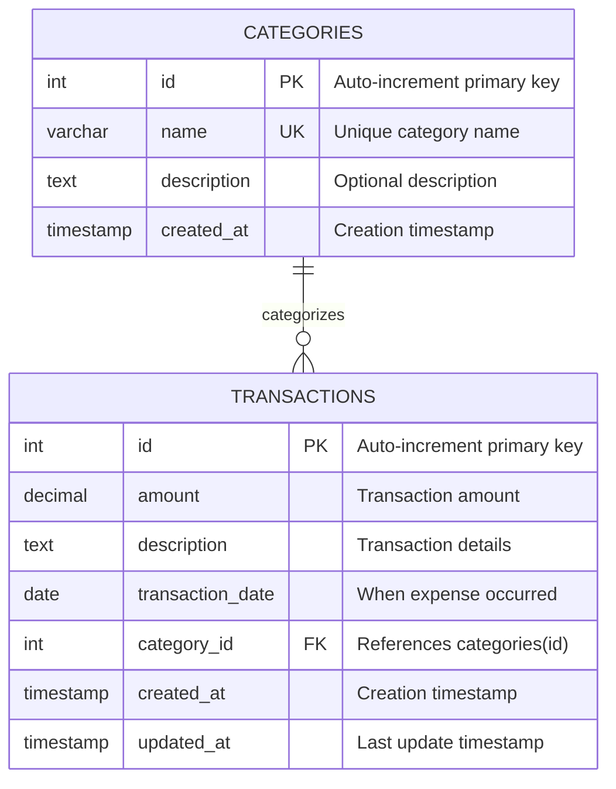

# Database Schema - Entity Relationship Diagram

This document contains the complete database schema for the Personal Expense Tracker application.

---

## Entity Relationship Diagram (ERD)



---

## Table Descriptions

### **categories Table**

Stores expense classification types. Each category represents a logical grouping of expenses (e.g., Food & Dining, Transportation).

**Columns:**
- `id` (INTEGER, PRIMARY KEY, AUTOINCREMENT): Unique identifier for each category
- `name` (VARCHAR(100), UNIQUE, NOT NULL): Category name (must be unique)
- `description` (TEXT, NULLABLE): Optional detailed description of category
- `created_at` (TIMESTAMP, DEFAULT CURRENT_TIMESTAMP): When category was created

**Constraints:**
- Primary Key: `id`
- Unique Constraint: `name` (prevents duplicate category names)

**Default Categories:**
- Food & Dining
- Transportation
- Shopping
- Entertainment
- Bills & Utilities
- Healthcare
- Education
- Other

---

### **transactions Table**

Stores individual expense records. Each transaction represents a single purchase or expense.

**Columns:**
- `id` (INTEGER, PRIMARY KEY, AUTOINCREMENT): Unique identifier for each transaction
- `amount` (DECIMAL(10,2), NOT NULL): Expense amount (supports up to 99,999,999.99)
- `description` (TEXT, NULLABLE): Details about the expense
- `transaction_date` (DATE, NOT NULL): When the expense occurred
- `category_id` (INTEGER, FOREIGN KEY): Links to categories table
- `created_at` (TIMESTAMP, DEFAULT CURRENT_TIMESTAMP): When record was created
- `updated_at` (TIMESTAMP, DEFAULT CURRENT_TIMESTAMP): When record was last modified

**Constraints:**
- Primary Key: `id`
- Foreign Key: `category_id` references `categories(id)`
- Not Null: `amount`, `transaction_date`

---

## Relationships

### **One-to-Many: CATEGORIES → TRANSACTIONS**

- **Cardinality**: One category can have many transactions (1:N)
- **Type**: One-to-Many
- **Foreign Key**: `transactions.category_id` → `categories.id`
- **Delete Rule**: RESTRICT (prevents deleting categories with existing transactions)
- **Update Rule**: CASCADE (category ID updates propagate to transactions)

**Example:**
```
Category: "Food & Dining" (id=1)
├── Transaction: "Grocery shopping" ($45.50)
├── Transaction: "Restaurant dinner" ($67.89)
└── Transaction: "Coffee shop" ($5.50)
```

---

## Indexes

Performance optimization indexes for common queries:

```sql
-- Index on transaction_date for date-based queries (monthly summaries)
CREATE INDEX idx_transaction_date ON transactions(transaction_date);

-- Index on category_id for category-based filtering
CREATE INDEX idx_category_id ON transactions(category_id);

-- Composite index for combined date and category queries
CREATE INDEX idx_date_category ON transactions(transaction_date, category_id);
```

**Benefits:**
- Faster monthly summary generation
- Improved category filtering performance
- Optimized date range queries

---

## Data Types

### SQLite Type Mapping

| Logical Type | SQLite Storage | Description |
|-------------|----------------|-------------|
| INTEGER | INTEGER | Signed integer (8 bytes) |
| VARCHAR(n) | TEXT | Variable-length text |
| TEXT | TEXT | Variable-length text |
| DECIMAL(10,2) | REAL | Floating-point (8 bytes) |
| DATE | TEXT | ISO 8601 format (YYYY-MM-DD) |
| TIMESTAMP | TEXT | ISO 8601 format with time |

---

## Sample Data

### Categories (Pre-loaded)

| id | name | description | created_at |
|----|------|-------------|------------|
| 1 | Food & Dining | Restaurant meals, groceries | 2025-01-01 10:00:00 |
| 2 | Transportation | Gas, public transit, parking | 2025-01-01 10:00:00 |
| 3 | Shopping | Clothing, electronics, misc | 2025-01-01 10:00:00 |
| 4 | Entertainment | Movies, games, subscriptions | 2025-01-01 10:00:00 |
| 5 | Bills & Utilities | Electric, water, internet | 2025-01-01 10:00:00 |
| 6 | Healthcare | Doctor visits, medications | 2025-01-01 10:00:00 |
| 7 | Education | Courses, books, tuition | 2025-01-01 10:00:00 |
| 8 | Other | Miscellaneous expenses | 2025-01-01 10:00:00 |

### Transactions (Example)

| id | amount | description | transaction_date | category_id |
|----|--------|-------------|------------------|-------------|
| 1 | 45.50 | Grocery shopping at Walmart | 2025-01-15 | 1 |
| 2 | 12.99 | Netflix subscription | 2025-01-10 | 4 |
| 3 | 35.00 | Gas station fill-up | 2025-01-12 | 2 |
| 4 | 89.99 | New running shoes | 2025-01-08 | 3 |
| 5 | 150.00 | Electric bill | 2025-01-05 | 5 |

---

## Common Queries

### View All Transactions with Categories

```sql
SELECT 
    t.id,
    t.amount,
    t.description,
    t.transaction_date,
    c.name as category
FROM transactions t
LEFT JOIN categories c ON t.category_id = c.id
ORDER BY t.transaction_date DESC;
```

### Monthly Summary by Category

```sql
SELECT 
    c.name,
    SUM(t.amount) as total,
    COUNT(*) as count
FROM transactions t
JOIN categories c ON t.category_id = c.id
WHERE strftime('%Y-%m', t.transaction_date) = '2025-01'
GROUP BY c.name
ORDER BY total DESC;
```

### Total Spending by Date Range

```sql
SELECT SUM(amount) as total
FROM transactions
WHERE transaction_date BETWEEN '2025-01-01' AND '2025-01-31';
```

### Find Top 5 Expenses

```sql
SELECT 
    t.description,
    t.amount,
    t.transaction_date,
    c.name as category
FROM transactions t
LEFT JOIN categories c ON t.category_id = c.id
ORDER BY t.amount DESC
LIMIT 5;
```

---

## Database Normalization

This schema follows **Third Normal Form (3NF)**:

### **First Normal Form (1NF):**
- All columns contain atomic values
- Each row is unique (primary keys)
- No repeating groups

### **Second Normal Form (2NF):**
- Meets 1NF
- No partial dependencies (all non-key attributes depend on entire primary key)

### **Third Normal Form (3NF):**
- Meets 2NF
- No transitive dependencies
- Category name stored once in categories table, referenced by ID

**Benefits:**
- Eliminates data redundancy
- Ensures data integrity
- Easier to maintain and update
- Prevents update anomalies

---

## Data Integrity Rules

### **Referential Integrity:**
- Every `transaction.category_id` must exist in `categories.id`
- Enforced by FOREIGN KEY constraint
- Prevents orphaned transactions

### **Entity Integrity:**
- Primary keys (`id` columns) are unique and not null
- Auto-increment ensures uniqueness

### **Domain Integrity:**
- `amount` must be a valid decimal number
- `transaction_date` must be a valid date
- `category.name` must be unique

### **Business Rules:**
- Transaction amount should be positive (not enforced at DB level)
- Transaction date should not be in future (not enforced at DB level)
- Description should be meaningful (not enforced at DB level)

---

## Future Schema Enhancements

### Planned Additions:

1. **budgets Table:**
   ```sql
   CREATE TABLE budgets (
       id INTEGER PRIMARY KEY AUTOINCREMENT,
       category_id INTEGER,
       amount DECIMAL(10,2),
       month DATE,
       FOREIGN KEY (category_id) REFERENCES categories(id)
   );
   ```

2. **recurring_transactions Table:**
   ```sql
   CREATE TABLE recurring_transactions (
       id INTEGER PRIMARY KEY AUTOINCREMENT,
       amount DECIMAL(10,2),
       description TEXT,
       category_id INTEGER,
       frequency VARCHAR(20),  -- 'daily', 'weekly', 'monthly', 'yearly'
       start_date DATE,
       end_date DATE,
       FOREIGN KEY (category_id) REFERENCES categories(id)
   );
   ```

3. **users Table** (for multi-user support):
   ```sql
   CREATE TABLE users (
       id INTEGER PRIMARY KEY AUTOINCREMENT,
       username VARCHAR(50) UNIQUE,
       email VARCHAR(100) UNIQUE,
       password_hash VARCHAR(255),
       created_at TIMESTAMP DEFAULT CURRENT_TIMESTAMP
   );
   ```

4. **tags Table** (for flexible categorization):
   ```sql
   CREATE TABLE tags (
       id INTEGER PRIMARY KEY AUTOINCREMENT,
       name VARCHAR(50) UNIQUE
   );
   
   CREATE TABLE transaction_tags (
       transaction_id INTEGER,
       tag_id INTEGER,
       PRIMARY KEY (transaction_id, tag_id),
       FOREIGN KEY (transaction_id) REFERENCES transactions(id),
       FOREIGN KEY (tag_id) REFERENCES tags(id)
   );
   ```

---

## Migration to PostgreSQL

When migrating to PostgreSQL, these changes are needed:

### Syntax Differences:

```sql
-- SQLite
id INTEGER PRIMARY KEY AUTOINCREMENT

-- PostgreSQL
id SERIAL PRIMARY KEY
```

### Date Functions:

```sql
-- SQLite
strftime('%Y-%m', transaction_date)

-- PostgreSQL
to_char(transaction_date, 'YYYY-MM')
```

### Type Differences:

| SQLite | PostgreSQL |
|--------|-----------|
| INTEGER AUTOINCREMENT | SERIAL or BIGSERIAL |
| TEXT | VARCHAR(n) or TEXT |
| REAL | NUMERIC(10,2) or DECIMAL(10,2) |

---

## Database File Location

**SQLite Database File:** `expenses.db` (created in project root directory)

**File Size:** Grows dynamically based on data
- Empty database: ~20 KB
- 1,000 transactions: ~100-200 KB
- 10,000 transactions: ~1-2 MB

**Backup:** Simply copy the `expenses.db` file

---

## Schema Version

**Current Version:** 1.0  
**Last Updated:** Novement 2025  
**Database Engine:** SQLite 3.x  
**Compatibility:** Java 17+ with JDBC 4.2+